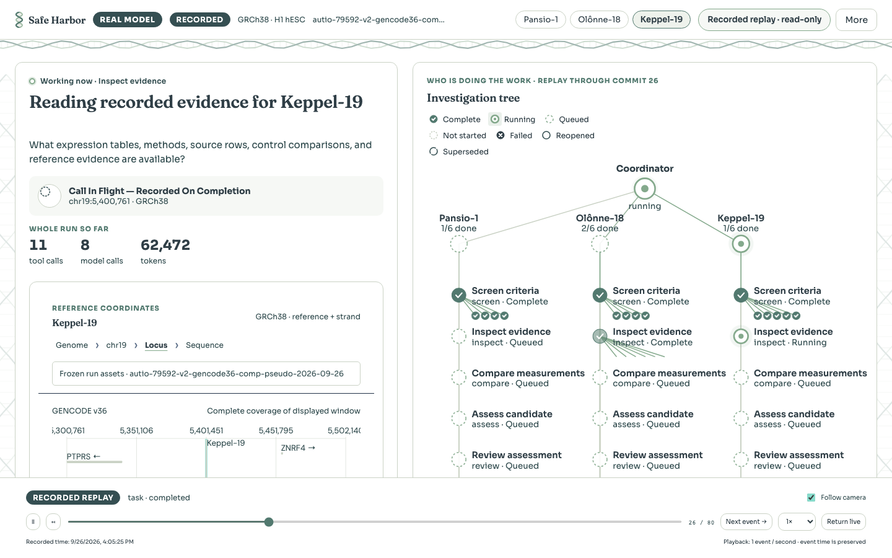
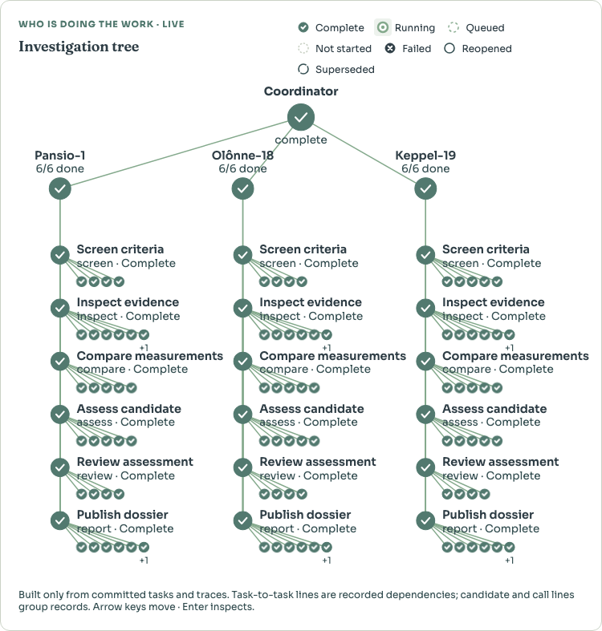
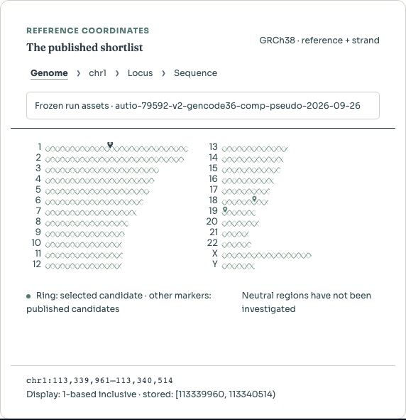
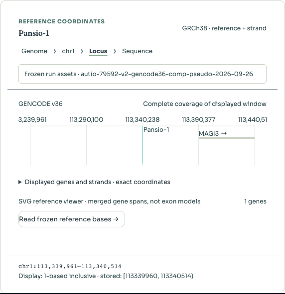
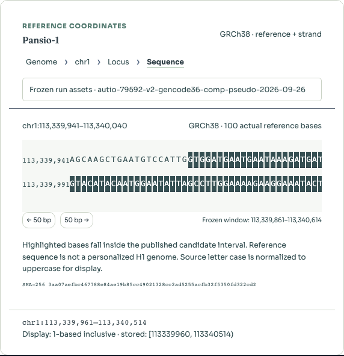
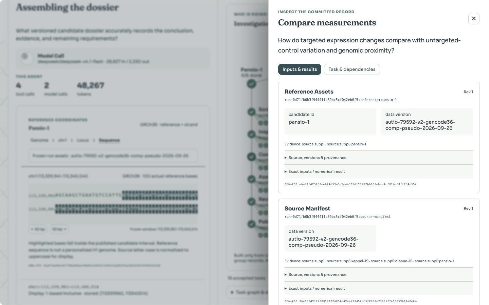
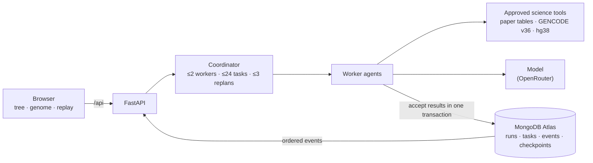

# Safe Harbor

**AI agents investigate candidate DNA insertion sites in the human genome, using real data, and every step they take is recorded so you can check it.**

[Open the live demo](https://safe-harbor-three.vercel.app) · [How it works](#how-it-works) · [Run it yourself](#run-it-locally) · [Specification](docs/safe-harbor/SPECIFICATION.md)



---

## The question

Gene therapies need somewhere to put new DNA. A *genomic safe harbor* is a spot where an insertion shouldn't disturb the genes around it. Autio et al. ([eLife, 2024](https://elifesciences.org/articles/79592)) proposed three such sites and measured what happened when they inserted DNA into human embryonic stem cells.

Safe Harbor asks one question about each site:

> **Do these measured expression changes justify excluding this candidate region?**

It doesn't search the genome for new sites, and it never calls a site "safe". It checks a published claim against the published data and shows its work.

| Candidate | Location (GRCh38) | Size |
|---|---|---|
| Pansio-1 | chr1:113,339,961–113,340,514 | 554 bp |
| Olônne-18 | chr18:56,534,775–56,536,439 | 1,665 bp |
| Keppel-19 | chr19:5,400,761–5,402,139 | 1,379 bp |

## What you're looking at

The [live demo](https://safe-harbor-three.vercel.app) replays a real investigation. DeepSeek worked through all three candidates, and every tool call, result and decision was saved to MongoDB Atlas as it happened. The page plays that record back from the start.

**Right: the investigation tree.** One coordinator, one branch per candidate, six agents per branch (screen → inspect → compare → assess → review → report). The small circles under each agent are its actual tool and model calls. Shapes carry the status, so it reads without color:



**Left: what the agent is doing right now**, in plain words, plus a genome view that zooms in as the work moves from the whole genome down to the actual DNA letters:

| Whole genome | One region | The actual bases |
|---|---|---|
|  |  |  |
| Chromosome lengths are real. Pins sit on the exact coordinates. | Gene annotations come from GENCODE v36. | These are the hg38 reference bases, not a generated pattern. |

**Click any agent** and you see exactly what it read and computed. Every number links back to a source file, row and hash:



## What one investigation found

Here's Pansio-1, in numbers you can check yourself:

- The targeted cells had **96** genes with significant expression changes (48 up, 48 down).
- Unmodified control cells, compared the same way, had **260**.
- **31 of the 96** (32%) also changed in the controls, every one in the same direction.

So a third of the "effect" of inserting DNA also shows up when you insert nothing. That doesn't make the site safe, and it doesn't prove anything harmful either. What the model concluded: *the expression data alone doesn't justify excluding Pansio-1, and the overall screen stays incomplete* because the cancer-gene, DHS and ultraconserved-region data aren't available.

These counts were recomputed straight from the original eLife spreadsheet, independently of the agents' tools, and they match.

## How it works



A few design choices matter more than the rest:

- **The database is the source of truth.** A worker's result only counts once it's written together with its task update, budget change and event, in a single MongoDB transaction. Re-submitting the same result returns the original; a conflicting one is rejected.
- **Crashes don't lose work.** Kill the server mid-run and a fresh process picks up where it stopped. Finished work isn't redone, and spend that can't be confirmed stays marked as uncertain.
- **Replay is honest.** The UI rebuilds any moment from the stored event log. It can't show something that hadn't happened yet at that point.
- **Budgets are hard limits.** Tokens, tool calls and cost are reserved before each call and settled after it.
- **The workflow can change itself, carefully.** A model can propose a structural change: split a role, add a reviewer, move a tool. The change is saved, compiled and run on held-out cases against two fixed baselines before it's adopted. It can't touch the criteria, the data, the model or the budget.

## Ground rules

These are enforced in code and in the evaluation, not just written down:

| Rule | What it means in practice |
|---|---|
| No global "safe" label | A site can pass *named* criteria. That's all a pass means. |
| Three separate statuses | `screen_status` (pass / fail / incomplete), `evidence_status` (supported / conflicting / unknown) and `freshness` (current / stale) are never merged into one verdict. |
| Missing ≠ negative | Missing required evidence makes a result *incomplete*, not a pass or a fail. |
| Label every run | Mock, deterministic, real model and recorded replay are always marked on screen. |
| No invented results | Improvements that weren't measured aren't claimed. Failed runs stay in the record. |

## Results so far

Where things stand (September 2026):

| | Status | Evidence |
|---|---|---|
| Source data | **Verified** | 15 source files match their recorded hashes; coordinates and reference bases check out. See [PROVENANCE.md](docs/safe-harbor/PROVENANCE.md). |
| Real investigation | **Done** | A real-model run of all three candidates finished 18/18 tasks: about 557k tokens over 36 model calls, roughly $0.03. The tool results it relied on recompute exactly from the exported inputs. |
| Crash recovery | **Done** | Killing the process mid-run passes all 15 recovery checks. |
| MongoDB Atlas | **Done** | Transactions, the full API and checkpointing verified on Atlas; all existing data migrated and checked collection by collection. |
| Self-improving workflow | **No improvement claimed** | A model proposed a real structural change (an extra reviewer, a moved tool). Validation **rejected** it because support and completion got worse, so the original workflow was kept. All 24 case/arm results are recorded, failures included. See [EVALUATION.md](docs/safe-harbor/EVALUATION.md). |
| Runtime races | **Open** | Some races remain in evidence revisions and budget accounting. Tracked in [STATUS.md](docs/safe-harbor/STATUS.md). |

## Run it locally

You need Python 3.12+, Node 20+, and a MongoDB Atlas cluster (the free M0 tier is enough).

```sh
git clone https://github.com/Nathan-T-Ray/Safe-Harbor.git && cd Safe-Harbor
python3 -m venv .venv
.venv/bin/pip install -r backend/requirements.lock
.venv/bin/pip install --no-deps -e backend
npm ci --prefix frontend
```

Create `.env` in the repo root. It's gitignored; never commit it.

```sh
MONGODB_URI="mongodb+srv://<user>:<password>@<cluster>.mongodb.net/?retryWrites=true&w=majority"
MONGODB_DATABASE=safe_harbor
# Only for real-model runs:
OPENROUTER_API_KEY=...
MODEL_ID=deepseek/deepseek-v4.1-flash
```

In Atlas, add your IP under **Network Access**. Then check the connection and start everything:

```sh
set -a; . ./.env; set +a; export PYTHONPATH=backend:.
.venv/bin/python e2e/safe_harbor/atlas_connectivity.py   # should end with "atlas_verified": true
.venv/bin/python scripts/safe_harbor_dev.py              # UI on :5174, API on :8010
```

No internet? `scripts/safe_harbor_dev.py --local-mongo` starts a local replica set instead. Full details: [STARTUP.md](docs/safe-harbor/STARTUP.md).

## Deploy

The public demo is a **read-only** deployment on Vercel: the static UI plus a small serverless API that reads recorded runs from Atlas. It can't start new runs, because the coordinator needs a server that stays up.

- `vercel.json` builds `frontend/` and routes `/api/*` to `api/index.py`.
- Set `MONGODB_URI`, `MONGODB_DATABASE` and optionally `SAFE_HARBOR_DEFAULT_RUN` in the Vercel project.
- Atlas must allow Vercel's IPs (`0.0.0.0/0`), so use a strong database password.

For live investigations, run the full API (`uvicorn safe_harbor.api:app`) on a host that stays up, such as Render, Railway, Fly.io or a VM, as a single instance.

## Repository map

| Path | What's there |
|---|---|
| `backend/safe_harbor/runtime/` | Ledger (transactions), coordinator, workers, revisions, context packets |
| `backend/safe_harbor/science/` | Data ingestion and the approved, bounded scientific tools |
| `backend/safe_harbor/harness/` | Saved workflow versions and the structural-change compiler |
| `backend/safe_harbor/evaluation/` | Baselines, isolated scoring, promotion rules |
| `backend/safe_harbor/api.py` · `mongo.py` | HTTP API · the single MongoDB connection point |
| `frontend/src/safe-harbor/` | React UI: tree, genome views, inspector, replay |
| `shared/` | Versioned record contracts (Python + TypeScript) |
| `data/safe_harbor/normalized/` | Ingested source data with row-level provenance |
| `e2e/safe_harbor/` | End-to-end journeys: real processes, real database |
| `scripts/` | Dev launcher, demo recorder, Atlas migration and cleanup |

## Contributing

Work is split into [tickets](docs/safe-harbor/TICKETS.md) tracked as GitHub issues. Read the [claim protocol](docs/safe-harbor/CONTRIBUTING.md), then claim a ticket before editing so two people don't change the same files.

Testing here means **end-to-end only**: real API processes against a real database, plus build, type and data-integrity checks. There are no unit or component tests, on purpose.

## Data and credits

- **Candidates and expression data:** Autio et al., *Computationally defined and in vitro validated putative genomic safe harbour loci for transgene expression in human cells*, eLife 2024;13. Supplementary files are used under CC BY 4.0.
- **Annotations:** GENCODE v36 via the UCSC Table Browser.
- **Reference sequence:** UCSC hg38 API.
- **Every source file, hash and license:** [PROVENANCE.md](docs/safe-harbor/PROVENANCE.md).

This is a research tool. It doesn't establish that any site is biologically safe.
